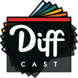

  

# DiffCast

**Auto-generate coding demos & screencasts from Python files.**

Provided with a series of Python files, DiffCast automatically generates coding
demos/screencasts using human-like edits. Designed for creating reproducible
tutoring examples, library demos or demonstrating code to a class.

Avoid distracting typos, reduce video editing time, narrate code changes without "umms and aaahss",
make screencast creation more accessible for people with disabilities. Regular editing speed makes demos easier to follow.

## What?

Programming screencasts are a popular way to teach programming and demo tools. Typically people will open up their favorite editor and record themselves tapping away. But this has a few problems. A good setup for coding isn't necessarily a good setup for video -- with text too small, a window too big, or too many distractions. Typing code in live means inevitable mistakes, even more so if you're narrating what you're doing at the same time. Mistakes means more time editing or confusion for the people watching.

**DiffCast** is an attempt to eliminate that, by generating screencasts from *testable* fully-working examples you prepare ahead of time. The editor view is configured to be large & easily readable in video, without messing with your IDE settings. Edits happen at a regular speed, without mistakes, making them easy to follow. Each _diffcast_ is completely reproducible, with the same files producing the same output every time.

## Install

* [Windows Installer](https://download.mfitzp.com/DiffCast.exe)
* macOS Installer (coming soon...)

## Demos

Below are some examples of screencasts created using DiffCast. These are short examples, to keep things readable but there is no limit to the number of transition files you can use, or how long the resulting DiffCast can be.

_Short demo, using the 4 demoN.py files in /demos. Demonstrates the block indenting behavior_
<video src="https://user-images.githubusercontent.com/126239/151127893-5c98ba8d-c431-4a25-bb1f-e0b33645a2b6.mp4"></video>

_Longer demo, using the 6 windows_N.py files in /demos. Demonstrates more complex edits, whitespace padding._
<video src="https://user-images.githubusercontent.com/126239/151128026-531c46db-30cb-466a-a836-8818718a2b13.mp4"></video>

## Interface

DiffCast costs of two windows -- (1) the code viewer and (2) the controller.

Configure the size of the code viewer component.

Add your intermediate files for generating the DiffCast from & then select the file in the list to start from.

Clicking *Start* will start playing a DiffCast from the currently selected file.
The first file will be loaded *as-is* and then edited until it matches the 2nd file, and then 3rd file and so on.

You can *Stop* the DiffCast at any time.

The *Prev* and *Next* buttons can be used to create DiffCasts stepping manually forwards (or backwards) through the changes, for example if you are demonstrating to a class.

Sometimes you want your current code to be *runnable* in a particular location -- for example, if you want to bring up a shell and run the same file as the changes are demonstrated. In this case you can use *Select output file...* to select the file to write the latest version to. Only the final working files are written (the state *after* the diff) so it will always work.

You can optionally show a file listing next to the code viewer, which will default to showing the selected output file in it's folder.

## FAQ

Some questions you'll probably ask.

### What do you mean by human-like edits?

When you edit a file you *generally* go from top to bottom, but you don't enter lines perfectly in order or delete lines before retyping them. To make the edits appear natural DiffCast tries to replicate some of these behaviors. Some examples --

* If you're adding a block of code which is followed by a blank line, a trailing blank line will be added first (adding space around the new code).
* Changes to the middle of lines will be edited in the middle of the line, leaving leading and trailing parts intact during editing.
* Whitespace is added in blocks of 4 (emulating tab indent) where possible.
* Blocks are indented as a whole, where possible.

This is a work in progress and new edits may be added.

### Does DiffCast create videos?

Not yet. But you can record the window using any normal screen recording software. It includes a few preset window sizes ideal for generating videos.

### Can I change the order edits are made?

Sure. Just add more intermediate files. For example, if you want to make edits to the bottom of a method before the top, you can create an intermediate file with the later edits and they will be applied first.

### Is this Python only?

Yes, right now. But the viewer component uses QScintilla as the editing component which includes lexers for many other languages. Other language support and syntax highlighting configuration will be added in a later version, if there is interest.

### Can you DiffCast through git commits?

Not yet, but it's a nice idea.
